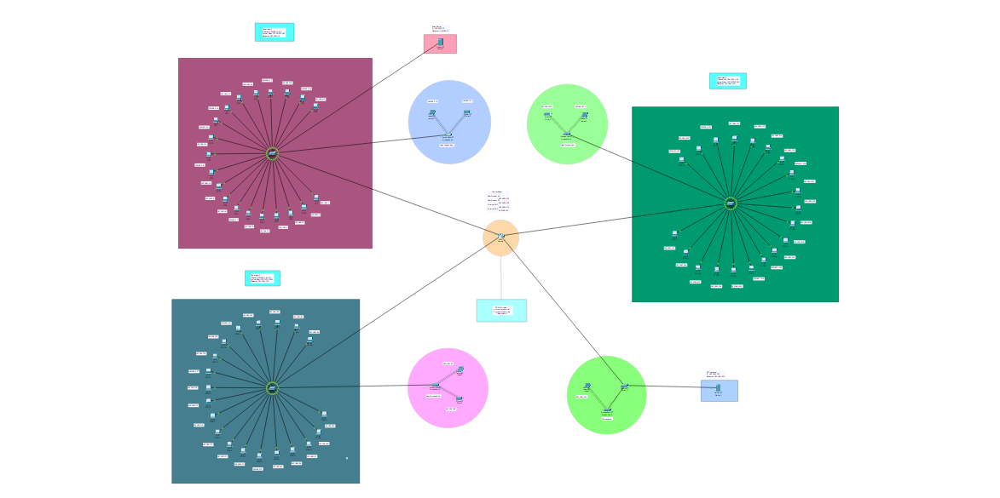
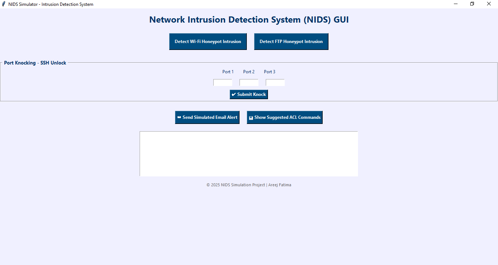
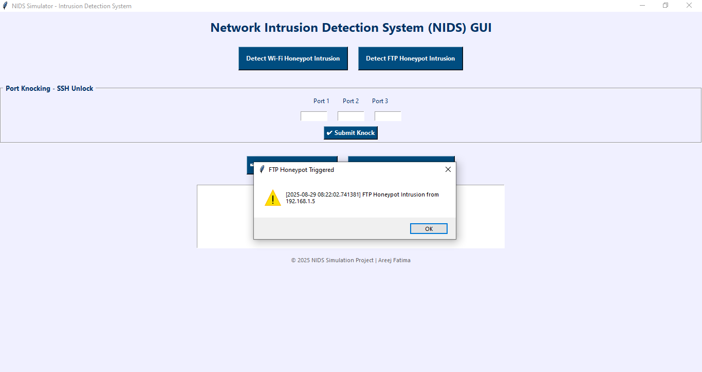
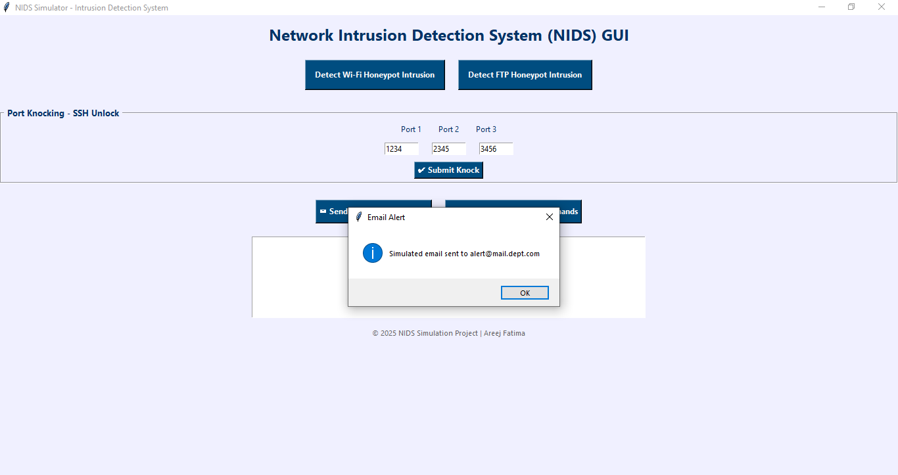
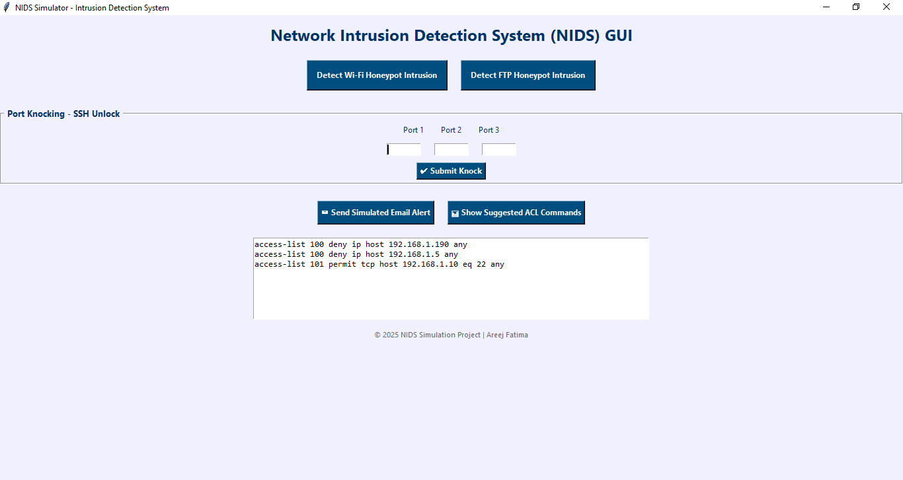

# Network Intrusion Detection System (NIDS) Simulation

### Project Overview
This project addresses the critical need for network security by implementing a Network Intrusion Detection System (NIDS). It simulates the detection and response to various types of unauthorized access within a structured organizational network. The system is designed for a business environment comprising three separate departments and combines **Cisco Packet Tracer** for network simulation with **Python programming** for automated intrusion detection logic.

### Key Objectives & Features
* **Design a Secure Multi-Department Network:** A structured network was developed using Cisco Packet Tracer that includes three isolated departments.
* **Implement Proper Subnetting and Routing:** The network was divided into unique address ranges for each department using subnetting and static routing.
* **Configure SMTP and FTP Servers:** Email and file transfer servers were set up to mimic typical organizational services.
* **Deploy Security Features:** Access Control Lists (ACLs) were applied on routers to block suspicious traffic and a simulated SSH mechanism was used with port knocking.
* **Establish Honeypots:** Both a Wi-Fi honeypot and an FTP honeypot were created to bait and detect intruders.
* **Integrate a GUI for Visualization:** A user-friendly Graphical User Interface was built using Python’s Tkinter module.
* **Log Events and Demonstrate Results:** The system maintains a time-stamped log of detected intrusions and provides simulated administrative alerts.

### Network Architecture
The network architecture is designed to simulate a real-world business environment where three departments operate independently yet are interconnected through a central infrastructure. Each department is a separate subnet, connected to a central router that ensures traffic routing and security policies are enforced.



### Technologies & Skills Used
* **Cisco Packet Tracer (Version 8.2.1):** Network simulation and configuration.
* **Python (Version 3.11):** Automation and intrusion detection logic.
* **Tkinter (Python GUI Library):** Creating a user-friendly GUI.
* **PyCharm IDE:** For writing and testing Python scripts.
* **Packet Tracer Terminal & Services Tabs:** Used for configuring CLI, SMTP, FTP, and SSH services.
* **Key Skills:** Network Design, Subnetting, Security Configuration, Rule-Based Threat Detection, Log Analysis, Automated Alerting, GUI Development.

### Code and Implementation
The core logic of the NIDS is handled by a complete Python script that automates intrusion detection, logs events, and simulates alerts.

```python
# The Python script is provided as a separate file, nids_script.py.
# This code handles the detection of Wi-Fi and FTP intrusions,
# simulates port knocking, and generates suggested ACL commands.
# Please see the file for the full implementation.
```

### GUI Screenshots
Below are screenshots of the user interface created with Tkinter, which allows for visual interaction with the NIDS simulation. Each image captures a key function of the system.

**1. Main GUI**


**2. Wi-Fi Honeypot Intrusion Alert**


**3. FTP Honeypot Intrusion Alert**


**4. Port Knocking Success**


**5. Email Alert Confirmation**


**6. Generated ACL Commands**


### Video Demonstration
Watch a full walkthrough of the NIDS GUI in action: **[NIDS GUI Walkthrough Video](nids_gui_video.mp4)**

### Conclusion
This project successfully demonstrates how to build and secure a departmental network using both simulation tools and scripting logic. By integrating CLI configurations, honeypots, SSH, ACLs, and Python-based automation, a complete NIDS system was simulated with full user interaction.

### Full Report & Documentation
For full project details, including testing, limitations, and references, you can download the original project report here: **[NIDS Report.docx](NIDS Report.docx)**
